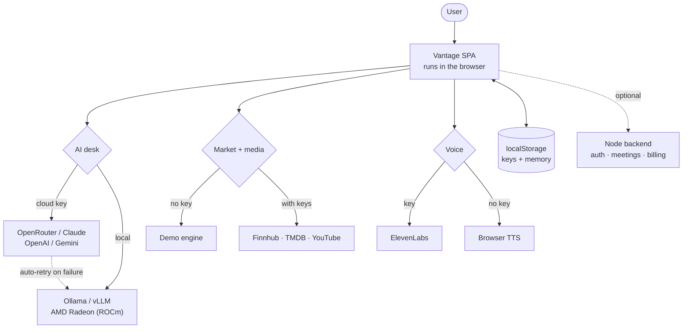
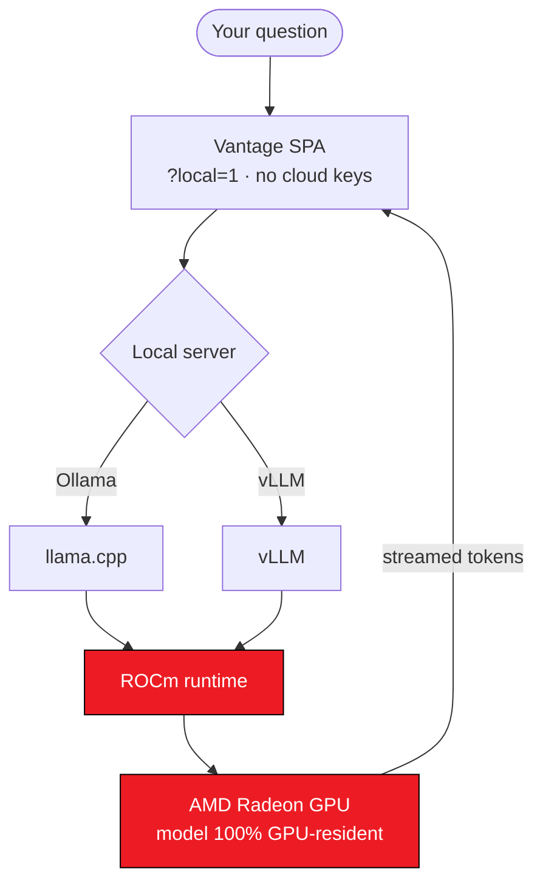

# Vantage

[](LICENSE)

> **License: [Apache 2.0](LICENSE)** — use, modify, and distribute freely (including commercially),
> provided you keep the copyright/license notices and state significant changes; includes an explicit
> patent grant from contributors. Provided "as is", without warranty.

A browser market dashboard fronted by an animated AI "broadcast desk." A single-page React app
where an animated news anchor charts stocks, answers questions out loud, reads the news, plays
trailers, hosts games, tracks a portfolio, and rings the opening bell on a real trading-day clock.

The dashboard runs **fully in the browser with zero setup**. Everything below (live data, AI answers,
studio voice, real meetings, accounts, subscriptions) is **optional** and layers on top.

> **Want to see what it produces without running it?** [`examples/`](examples/) holds real
> generated output — catalog answers and refusals, an analyst report, and the complete list of
> queries the server can send — all readable straight in the file viewer.

---

## How it works

Everything in the solid path runs in the browser. The backend is dotted because it is entirely
optional — the app is fully usable without it.



Two properties worth calling out:

- **Keys and conversation memory never leave the device** — they live in `localStorage` and are sent
  only to their own provider's API.
- **The desk degrades instead of breaking.** No AI key → everything but answers still works. No
  ElevenLabs key → browser speech. Cloud model fails → it retries on your local model. Quotes have
  two providers and fall back to a keyless one, so Finnhub going down (or never being configured)
  costs you real prices for as long as it takes the fallback to answer — and `/api/status` names
  which one is carrying the tape, because a failover nobody can see is worse than an outage.

---

## Quick start

```bash
npm install
npm run dev            # → http://127.0.0.1:5173
```

That's it — the app opens in **Demo mode**, driven by a seeded random-walk market engine (no keys
needed). `npm run build` produces a static bundle in `dist/`.

Requires **Node 20+** (the backend uses `--env-file`). Check with `node --version`.

---

## Run on AMD Radeon / ROCm (fully local agent — no cloud keys)

The AI desk is an agent (tool use, multi-step commands, local multi-turn memory) whose core
inference can run **entirely on a local model** — on an AMD Radeon GPU through ROCm.



Every desk answer, report, and voice reply follows this path — no request leaves the machine.
Step by step:

1. **Serve a model locally** (either works):
   - **Ollama** (uses ROCm on Radeon): `ollama pull llama3.1`, then allow the browser origin:
     ```bash
     OLLAMA_ORIGINS=* ollama serve        # PowerShell: $env:OLLAMA_ORIGINS='*'; ollama serve
     ```
   - **vLLM** (ROCm build, OpenAI-compatible): `vllm serve <model> --host 0.0.0.0 --port 8000`
2. **Start Vantage**: `npm run dev`, then open the one-click URL for whichever server you started —
   **`http://127.0.0.1:5173/?local=1`** for Ollama, or **`http://127.0.0.1:5173/?local=vllm`** for vLLM
   (auto-detects the served model; optional `&base=<url>` / `&model=<id>` overrides). Either enables
   *only* that local model — every desk answer, report, and command now runs on local inference.
   The same switch lives at **settings → AI → "⚡ Run local-only (AMD / ROCm)"**.
3. **Verify the GPU is actually doing the work** (Ollama silently falls back to CPU if ROCm
   isn't engaged):
   ```bash
   ollama ps        # PROCESSOR column must read "100% GPU"
   rocm-smi         # GPU utilization + VRAM jump during a query
   ```
4. **What you should see**: sign in, ask the desk *"chart AMD and explain the move"* — the answer
   header reads `Ollama (local) (llama3.1)`, and it works with the network cable pulled.

Troubleshooting: `model "llama3.1" not found` → `ollama pull llama3.1` (or set MODEL to one from
`ollama list`). "Can't reach Ollama" → start it with `OLLAMA_ORIGINS=*` as above.

---

## DataHub catalog context (optional)

Point the desk at a [DataHub](https://datahub.com) instance and it answers questions about your
data — schemas, owners, and lineage — from the live catalog, read on air by the anchor.

1. Start DataHub (quickstart on `http://localhost:9002`, GMS on `http://localhost:8080`).
2. Set the server-side var (the token never reaches the browser):

   ```bash
   DATAHUB_GMS_URL=http://localhost:8080
   DATAHUB_TOKEN=<your personal access token>  # Only needed if auth is enabled; generate in Settings → Access Tokens
   ```

3. The quickstart ships with an empty catalog — ingest sample metadata before the desk can
   answer questions.
4. Run the backend: `node --env-file=.env server/index.js`, then ask the desk:
   - *"who owns the fct_users_created table?"*
   - *"what columns are in the customers dataset?"*
   - *"what feeds fct_users_created?"*

Queries are **read-only** and limited to a server-side whitelist. If DataHub is unreachable, the
desk reports the lookup failed — it never invents catalog facts. When the desk doesn't find an
exact match for a dataset name, it discloses the closest match instead of silently answering
about a different one.

### Seeing the honesty behaviour

The interesting case is when the catalog knows the dataset but *not the answer* — a small model
handed an incomplete fact block will happily invent owners and column lists. Here the model is
removed from the path entirely and the gap is stated instead.

DataHub's sample metadata is fully populated, so nothing exercises this. Ingest a deliberately
incomplete dataset:

```bash
node scripts/datahub/ingest-bare.cjs
```

Then ask — each answers with **no model involved** (the response header reads `DataHub (catalog)`
rather than `DataHub + <model>`, so you can tell at a glance):

| Ask | Answer |
| --- | --- |
| *"who owns the orders_v2 table?"* | DataHub has no owner recorded for orders_v2. |
| *"what columns are in the orders_v2 table?"* | DataHub has no schema recorded for orders_v2. |
| *"what type is the foobar column in fct_users_created?"* | …has no column named "foobar". |
| *"what feeds the SampleKafkaDataset dataset?"* | DataHub records no upstream datasets for it. |

A question the catalog *can* answer still goes to a model for narration — compare
*"in fct_users_created, what type is the user_id column?"*, which reports the real type.

---

## Optional API keys (each unlocks one extra)

All keys live in your **browser's localStorage only** — they're sent only to their own provider's
API, never to us. Enter them in **settings** (⚙, top-right).

| Key | Unlocks | Where | Get one / rotate it |
|-----|---------|-------|---------------------|
| OpenRouter / Claude / OpenAI / Gemini / Ollama / LM Studio | AI desk answers | settings → AI | [openrouter.ai/keys](https://openrouter.ai/keys) · [aistudio.google.com/apikey](https://aistudio.google.com/apikey) |
| Finnhub | Live quotes + earnings calendar | settings → DATA | [finnhub.io/dashboard](https://finnhub.io/dashboard) |
| TMDB | Streaming catalog + trailers | settings → START/DATA | [themoviedb.org/settings/api](https://www.themoviedb.org/settings/api) |
| YouTube | Real embeddable video results | settings → DATA | [console.cloud.google.com/apis/credentials](https://console.cloud.google.com/apis/credentials) |
| ElevenLabs | Studio-grade anchor voice | settings → VOICE | [elevenlabs.io/app/settings/api-keys](https://elevenlabs.io/app/settings/api-keys) |

Without any of them the app still runs — demo data, browser text-to-speech, and the full UI.

---

## The optional backend (`server/index.js`)

A tiny **dependency-free** Node server (built-ins only). It exists to hold the secrets a browser must
never see, and adds three independent layers — **each optional**:

| Layer | What it adds | Needs |
|-------|--------------|-------|
| **Accounts** (`/api/auth/*`) | Real sign-up / login with scrypt-hashed passwords + session tokens | nothing (works as soon as the backend runs) |
| **Meetings** (`/api/:prov/*`) | Create real **Zoom / Google Meet** links, per user | your own Zoom/Google OAuth apps |
| **Billing** (`/api/billing/*`) | Real **Stripe Checkout** for paid plans (test mode) | your own Stripe test keys |
| **Hosted AI** (`/api/ai/brief`) | Vantage-operated Gemini market briefs, metering, and audit logs | Vertex AI service account |

If the backend isn't running, the app falls back gracefully: accounts run **client-side** in
localStorage, meetings use the **zero-setup** path (see below), and paid plans unlock as a clearly
labelled **simulation**.

### Run it

```bash
cp .env.example .env                          # fill in only what you want
node --env-file=.env server/index.js          # second terminal, keep `npm run dev` in the first
```

It listens on **http://localhost:8787**; the Vite dev server proxies `/api` to it automatically
(see `vite.config.js`), so the browser treats it as same-origin.

### Environment variables (`.env`, see `.env.example`)

```
# Provider keys the SERVER holds. These are separate from the browser-side keys
# in the table above — a key here is never sent to the browser, and it is what
# lets a visitor use a feature without bringing a key of their own.
OPENROUTER_API_KEY / OPENROUTER_MODEL         # AI desk answers
GEMINI_API_KEY                                # Gemini answers + market briefs
FINNHUB_API_KEY                               # search, earnings, news — and quotes,
                                              #   where it is PREFERRED, not required:
                                              #   quotes fall back to a keyless provider
BREAKER_REST_MS                               # how long a failing quote provider sits
                                              #   out before one request probes it (60s)
TMDB_API_KEY                                  # film & TV catalog
YOUTUBE_API_KEY                               # video search
ELEVENLABS_API_KEY                            # studio anchor voice

# Billing
STRIPE_SECRET_KEY                             # billing (optional; else simulated)
STRIPE_PRICE_EXPLORER / _PRO / _DESK          # Stripe Price IDs; every plan is paid
STRIPE_WEBHOOK_SECRET                         # Stripe endpoint-signing secret

# Sign-in and meetings — OAuth apps you register yourself
ZOOM_CLIENT_ID / ZOOM_CLIENT_SECRET           # meetings (optional)
GOOGLE_CLIENT_ID / GOOGLE_CLIENT_SECRET       # meetings + calendar (optional)
YAHOO_CLIENT_ID / YAHOO_CLIENT_SECRET         # Yahoo sign-in (optional)

# Vertex AI — the hosted-brief path
GOOGLE_CLOUD_PROJECT / GOOGLE_CLOUD_LOCATION  # Vertex AI project and region
GCP_SERVICE_ACCOUNT_EMAIL / _PRIVATE_KEY      # Vertex AI service account (server-only)
VERTEX_GEMINI_MODEL                           # defaults to gemini-3.6-flash

# Metering: how much of YOUR provider spend a signed-out visitor may use,
# per IP per hour. These are the ceiling on what a stranger can cost you.
ANON_AI_PER_HOUR      (default 6)
ANON_TTS_PER_HOUR     (default 30)    # ElevenLabs bills per character
ANON_YT_PER_HOUR      (default 20)
ANON_QUOTE_PER_HOUR   (default 1000)  # one watchlist tick is one call

AGENT_CRON_SECRET                             # protects the scheduled-agent endpoint
DATAHUB_GMS_URL / DATAHUB_TOKEN               # optional catalog context (see above)
SPOTIFY_PLAYLIST                              # defaults to a public playlist
TRUST_PROXY                                   # set to exactly "1" behind a reverse proxy, so
                                              # rate limits read X-Forwarded-For and not the proxy
PORT           (default 8787)
PUBLIC_ORIGIN  (default http://localhost:8787 — must match your OAuth redirect URIs)
APP_ORIGIN     (default http://127.0.0.1:5173 — where the dashboard runs)
```

> **You don't have to hand-edit a file.** `.env` is just one way to set these. On a real host
> (Vercel / Render / Railway, Docker `-e`, or a shell `export`) set them as normal environment
> variables — the server reads `process.env` either way. See [MEETINGS_SETUP.md](MEETINGS_SETUP.md).

### Rotating a key

Consoles, so you can get at them without hunting:

| Variable | Console |
|----------|---------|
| `OPENROUTER_API_KEY` | [openrouter.ai/keys](https://openrouter.ai/keys) |
| `GEMINI_API_KEY` | [aistudio.google.com/apikey](https://aistudio.google.com/apikey) |
| `FINNHUB_API_KEY` | [finnhub.io/dashboard](https://finnhub.io/dashboard) |
| `TMDB_API_KEY` | [themoviedb.org/settings/api](https://www.themoviedb.org/settings/api) |
| `YOUTUBE_API_KEY` | [console.cloud.google.com/apis/credentials](https://console.cloud.google.com/apis/credentials) |
| `ELEVENLABS_API_KEY` | [elevenlabs.io/app/settings/api-keys](https://elevenlabs.io/app/settings/api-keys) |
| `STRIPE_SECRET_KEY` | [dashboard.stripe.com/apikeys](https://dashboard.stripe.com/apikeys) |
| `STRIPE_PRICE_*` | [dashboard.stripe.com/products](https://dashboard.stripe.com/products) — copy the **Price** ID (`price_…`), not the product's |
| `STRIPE_WEBHOOK_SECRET` | [dashboard.stripe.com/webhooks](https://dashboard.stripe.com/webhooks) — the endpoint's signing secret (`whsec_…`) |

The order matters, because the last step is irreversible:

1. Issue the new key **without deleting the old one**.
2. Paste it into `.env` — no quotes, no trailing space. A key with a stray character is *set* and refused, which looks exactly like a revoked one.
3. Restart the server. It must be `npm run server`, or `node --env-file=.env server/index.js` — plain `node server/index.js` starts fine and reports every key as unset.
4. Run the checker (below). It makes one real call per service, because `/api/status` only knows whether a key is *present* — and a revoked key is present.
5. Only once the new key reads `ok`, go back and revoke the old one.

```bash
node scripts/check-keys.mjs
```

---

## Meetings: two tiers

1. **Zero-setup (no backend, no keys)** — settings → **MEET** → **⚡ Go Live**: opens an instant
   Google Meet (`meet.new`) or Zoom in a new tab, or pin any link you paste as a 🔴 LIVE badge.
   This is what most people use.
2. **Tracked meetings (per-user OAuth)** — sign in, then **Connect Zoom / Google**. Meetings are
   created on **your own** account and listed inside Vantage. Full walkthrough:
   **[MEETINGS_SETUP.md](MEETINGS_SETUP.md)**.

---

## Accounts & subscriptions

- **Sign up / log in** at the gate (or **Explore as guest** to skip it).
- When the backend is running, auth is real (hashed passwords + server sessions). Otherwise it's a
  client-side prototype in localStorage.
- **Plans**: Explorer $12/mo · Pro Desk $25/mo · Trading Floor $39/mo. There is **no free tier** —
  every plan starts with a 7-day trial, which the server adds to the Checkout session
  (`subscription_data[trial_period_days]`) so the first charge really does fall on day 8.
  Upgrades open **Stripe's hosted checkout** when `STRIPE_SECRET_KEY` is set; without it, the plan
  unlocks as a labelled simulation and nothing is charged on day 8 either.
  Card details are only ever entered on Stripe's page — this app never renders a card form.

---

## Project layout

```
React.jsx          the whole UI (one big component + a few module components)
exporters.js       lazy-loaded Excel / Word / PowerPoint generators
src/datahub/       catalog intent detection, whitelisted queries, honesty checks (+ tests)
src/settings/      preferences & local-proof modules (+ tests)
server/index.js    the optional backend: accounts, meetings, billing (dependency-free)
examples/          real generated output — read it without running anything
scripts/datahub/   seed a bare dataset to reproduce the refusal behaviour
index.html         Vite entry
vite.config.js     dev server + /api → backend proxy
MEETINGS_SETUP.md  step-by-step Zoom / Google OAuth setup
```

---

## Security

Read **[SECURITY.md](SECURITY.md)** before deploying any part of this beyond your own machine.
It covers what's deliberate and what's a prototype shortcut — the client-side account layer, the
client-trusted Stripe redirect, where API keys are held, and how to report a vulnerability
privately.

Short version: Vantage is a prototype. It runs entirely in the browser by default, and the
optional Node backend is dev/local-oriented.

---

## Disclaimer

Vantage is a market-information and entertainment dashboard. It is **not financial advice**, and
nothing shown is a recommendation to buy or sell. Market data may be delayed, simulated, or
inaccurate — don't rely on it for trading decisions.

---

## License

Released under the **Apache License 2.0** (noted at the top of this README) — see [`LICENSE`](LICENSE)
for the full text.
