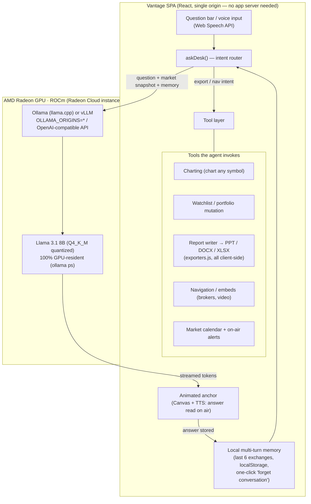

# Vantage — Project Specification Document
### AMD AI DevMaster Hackathon · Track 2: Development & Local Deployment of Private AI Agents

> Team: **Team Vantage** · Members: **Ryan Wien** (solo) · Contact: **ryanwien3d@gmail.com**
> Repository: https://github.com/ryanwien/VantageApplication
> Convert this document to PDF for submission (VS Code: print → Save as PDF, or any md→pdf tool).

---

## 1. Application Scenarios

**Vantage is a private AI market-intelligence agent — a personal "broadcast desk" for the markets that runs entirely on a local model on an AMD Radeon GPU.**

Traditional market tools are dense terminals with no intelligence, and AI market tools ship every question you ask — your watchlist, your portfolio, your intentions — to a cloud API. Vantage breaks that trade-off: an animated news anchor charts any stock, explains moves in plain language (spoken aloud, in 6 languages), executes commands, writes exportable reports — and in local-only mode, **no prompt, no portfolio, and no question ever leaves the machine**.

Scenario coverage (from the Track 2 list):
- **Personal intelligent assistant** — "chart AMD and explain the move", "what about its risks?" (multi-turn), price alerts, market calendar with on-air reminders
- **Industry-specific service agent** — finance/market intelligence domain, with a strict "not financial advice" analytical framing
- **Office automation assistant** — one command writes an analyst report and exports it as PowerPoint / Word / Excel
- **Life management** — watchlist, portfolio tracking, scheduled market events

Target users: retail investors and finance-curious users who want market intelligence that is **private by architecture**, not by policy.

## 2. Agent Architecture

**Flow:** one input box drives everything. `askDesk()` first parses **intent** (export? navigation? alert?) and executes tools directly; open questions are wrapped with a live **market-data snapshot** plus the **local conversation memory** and streamed to the local model on the Radeon GPU. Streamed tokens render live and are spoken by the anchor; the exchange is written back to local memory so follow-ups ("and its risks?") resolve.

**Neutral, open stack (per Track 2 rules):** the agent loop is our own open code (no closed-source agent platform); serving is **Ollama (llama.cpp) or vLLM**, both listed frameworks, both ROCm-adapted.

## 3. Core Capabilities (vs. the 5 minimum functional requirements)

| Track 2 capability | Vantage implementation | Status |
|---|---|---|
| **Tool invocation** | Charting, watchlist/portfolio mutation, report writer with PPT/Word/Excel export, navigation/embeds, calendar + alerts — all invoked from natural language by the intent router | ✅ shipped |
| **Local multi-turn memory** | Last 6 exchanges kept in `localStorage`, threaded into every model call; follow-up questions resolve against prior turns; survives reload; never leaves the device | ✅ shipped, e2e-verified |
| **Permission control & privacy** | Account system with plan gates; local-only mode (`?local=1`) disables every cloud model; **"forget conversation"** clears memory in one click; demo market data means zero external calls | ✅ shipped |
| Multi-step task planning | Intent router chains steps (e.g. "write a report and export ppt" → generate via local model → build deck) | partial |
| Local knowledge retrieval (RAG) | Market snapshot injection (structured local data grounds every answer) | partial |

**Multi-turn verification (reproducible):** turn 1: *"my codeword is BLUEFALCON"* → turn 2: *"what is my codeword?"* → the desk answers **BLUEFALCON** from local memory, in 568 ms on a local model.

## 4. Model Introduction & Local Deployment Plan

**Model:** Llama 3.1 8B Instruct (open weights), **Q4_K_M quantization** (Ollama default) — chosen for the best answer-quality-to-VRAM ratio for conversational market analysis; fits comfortably in Radeon VRAM with the full model GPU-resident.

**Deployment (AMD Radeon Cloud):**
1. Launch a Radeon Cloud instance (template → Launch → JupyterLab terminal or SSH)
2. Run our setup script: `bash scripts/radeon-setup.sh` — installs Ollama (ROCm backend), pulls `llama3.1`, starts serving with `OLLAMA_ORIGINS=*`, installs Node 20, builds and serves Vantage
3. Open `http://127.0.0.1:5173/?local=1` (via SSH tunnel: `ssh -L 5173:localhost:5173 <user>@<host> -p <port>`) — this **one URL parameter** switches the entire agent to local inference: only the Ollama model is enabled, no cloud keys exist anywhere
4. **Verify GPU residency:** `ollama ps` must report **100% GPU**; `rocm-smi` shows utilization + VRAM under load

Full reproduction steps live in the repository README ("Run on AMD Radeon / ROCm"), including troubleshooting (model not pulled, browser origin blocked, silent CPU fallback).

**Evidence to include with submission (captured on the Radeon instance):**
- [ ] `rocm-smi` during an answer (GPU util + VRAM)
- [ ] `ollama ps` showing `100% GPU`
- [ ] Screen recording: question → streamed answer, offline

## 5. Optimization Description — Inference Speed on AMD Radeon GPU

Four concrete optimizations, each measurable with the same query set:

1. **Quantization (Q4_K_M vs FP16):** 8B weights at ~4.9 GB instead of ~16 GB — the whole model stays GPU-resident (no CPU offload split), roughly halving memory bandwidth per token, the binding constraint for single-stream decode.
2. **Prompt budget control:** conversation memory is capped at 6 exchanges of **raw Q/A text** (not snapshot-wrapped prompts), and the market snapshot is compact structured JSON — prefill stays small and roughly constant instead of growing with the session.
3. **Streaming end-to-end:** tokens render (and can be spoken) as they decode, so perceived latency ≈ time-to-first-token rather than full completion time.
4. **Model right-sizing option:** a one-line model swap (`llama3.2:1b`) for latency-critical demos; measured on our dev box the 1B answers in ~half the wall-clock of the 8B on identical questions.

**Measured baseline (dev box, methodology to be re-run on the Radeon instance):**

| Setup | Query | Wall-clock |
|---|---|---|
| llama3.1 8B Q4_K_M, 100% GPU | "what is a stock ticker?" (cold conversation) | 796–1134 ms |
| llama3.2 1B, 100% GPU | same | 554–568 ms |
| llama3.1 8B, memory-recall turn | "what is my codeword?" | 568 ms |

**Radeon numbers (fill in on the instance):**

| Setup | Time-to-first-token | Full answer | tokens/s |
|---|---|---|---|
| llama3.1 8B Q4_K_M on Radeon (ROCm) | [TODO] | [TODO] | [TODO] |
| llama3.2 1B on Radeon (ROCm) | [TODO] | [TODO] | [TODO] |

## 6. Deliverables

- **Web UI** (deliverable form per rules): the Vantage dashboard — sign-in, live agent desk, anchor, exports
- **Source code:** complete repository with README (environment configuration, startup guide, dependency list, AMD/ROCm runbook)
- **Demo video:** 3–5 min, recorded on the Radeon instance — `rocm-smi` + `ollama ps` on camera, then live agent: chart AMD → multi-turn follow-up → voice command → report export → offline test
- **Supplementary:** poster (`submission/poster.html` → PDF)

## 7. Team

| Name | Role | Contribution |
|---|---|---|
| Ryan Wien | Founder / Developer (solo) | Entire project: the Vantage agent (intent router, tool layer, local multi-turn memory), animated anchor + TTS broadcast experience, local-only AMD/ROCm deployment mode, report exporters, and this submission. |
